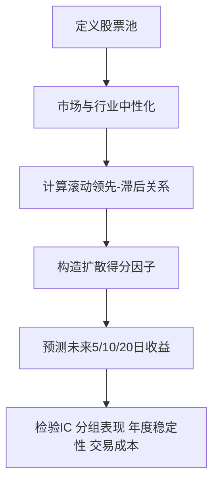

# 股票相关性 / 领先滞后 / 延迟上涨研究方向梳理

## 背景

当前想研究的并不是“相关性”本身，而是：

> 某些股票先动，其他股票是否会在未来若干天内延迟跟涨，从而提供可交易的利润空间。

这类机会更准确的定义应为：

- 信息扩散（information diffusion）
- 领先—滞后（lead-lag）
- 价格传播（spillover）
- 延迟反应（delayed reaction）

因此，**相关性只是筛选关系的工具，不是 alpha 本身**。

---

## 核心判断

### 1. 这个方向值得研究

相比纯“抄底”或过于学术化的 Copula 建模，“股票之间的领先—滞后传播”更贴近 A 股真实交易结构，也更容易和现有量化框架结合。

### 2. 真正可交易的不是同步相关，而是滞后传播

应区分两类关系：

- **同步相关**：A 和 B 今天一起涨
- **领先滞后**：A 先涨，B 在未来 1~10 个交易日才跟涨

前者大多不能直接交易，后者才可能转化为可捕捉的收益。

### 3. 研究重点应从“原始相关性”转向“残差收益传播”

若直接研究原始收益相关性，容易把以下现象误当 alpha：

- 市场整体上涨
- 行业整体拉升
- 风格共振（如小盘、成长、题材）
- Beta 暴露

因此更合理的对象是：

> **扣除市场和行业影响后的残差收益，是否存在稳定的领先—滞后传导。**

---

## 这条路最可能成立的几个研究方向

## 方向一：行业龙头 → 二线跟风股

### 逻辑

A 股中，资金往往先打行业龙头，再逐步扩散到二线、三线标的。

典型路径：

- 龙头先放量突破
- 行业情绪升温
- 二线股 1~5 天后补涨

### 研究对象

- 同行业内股票
- 以流动性、成交额、市值、关注度筛选 leader
- 研究 leader 最近 3~5 日收益，对 follower 未来 5~10 日收益的预测能力

### 优点

- 符合真实资金传播路径
- 可解释性强
- 比全市场任意配对更稳定

### 风险

- 主题炒作阶段会高度拥挤
- 行业退潮时传播关系会失效
- 容易误把行业整体上涨当作 lead-lag

---

## 方向二：大票 → 小票 的风格内传播

### 逻辑

同一行业或同一题材中，大市值股票往往先反映机构预期，小票和跟风标的随后被情绪资金接力。

### 研究对象

- 同行业内按流通市值分层
- 大市值组近期残差收益
- 对中小市值组未来收益的预测能力

### 候选定义

可以构造：

- largecap_to_smallcap_lag_score
- big_stock_lead_small_stock_follow

### 优点

- 与已有“风格切换 / 大小盘传播”语境一致
- 比随机 pair 更有结构化含义

### 风险

- 很容易重新引入小盘偏移
- 小票成交差，实盘滑点和涨停限制更严重
- 回测结果可能被流动性幻觉夸大

---

## 方向三：行业指数 / ETF / 行业篮子 → 个股

### 逻辑

如果行业层面先被资金买入，那么个股不一定同步完成定价，部分个股可能在未来几天内才逐步反应。

### 研究对象

- 行业指数过去 3/5 日收益
- 行业内个股未来 5/10 日收益
- 或行业收益超出市场收益后的超额部分，对个股后续表现的影响

### 优点

- 比股票对股票更稳
- 降低 pair 数量爆炸问题
- 易于与行业轮动研究结合

### 风险

- 需要区分行业 beta 与个股 alpha
- 可能最终只得到一个行业动量因子，而不是个股延迟传播因子

---

## 方向四：产业链 lead-lag 传播

### 逻辑

产业链上的不同环节，在盈利预期和资金传播上存在先后顺序：

- 上游价格或景气先变动
- 中游设备或制造链条后反应
- 下游应用场景再跟进

### 研究对象

- 人工构造产业链映射
- 研究上游组收益对下游组未来收益的预测作用
- 或研究核心节点股票对关联股票的 spillover

### 优点

- 若成立，alpha 质量可能高于普通相关性
- 更接近真实经济传导

### 风险

- 数据标注成本高
- 映射关系主观性强
- 容易过拟合到某几个历史主题周期

---

## 不建议直接做的方向

## 1. 全市场任意两两股票相关性地毯搜索

原因：

- pair 数量极大
- 统计显著性假象多
- 容易挖到噪音关系
- 可解释性和稳定性很差

## 2. 只看同步相关性

同步相关大多无法直接交易，只能说明共同暴露，不能说明谁先谁后。

## 3. 直接在低流动性小票上寻找“神迹”

这很容易在回测中看起来很美，实盘则被以下因素毁掉：

- 滑点
- 冲击成本
- 涨跌停
- T+1
- 题材退潮后的流动性坍缩

---

## 推荐的统一研究框架



---

## 研究实现原则

## 1. 先做股票池约束

建议：

- 剔除 ST / 停牌 / 新股
- 剔除经常涨跌停股票
- 仅保留流动性前 800~1500 只股票
- 优先在行业内做研究，不直接全市场乱扫

## 2. 用残差收益代替原始收益

建议至少做：

- 市场中性化
- 行业中性化

目标是研究：

> 某股票自身信息是否会传播，而不是整个行业一起涨。

## 3. 核心统计量应使用正滞后关系

重点应看：

- corr(r_i(t-k), r_j(t))
- 或回归：r_j(t+h) ~ r_i(t-k:t)

其中：

- k 可取 1, 2, 3, 5
- h 可取 5, 10, 20

## 4. 更适合做成横截面因子，而不是一堆手工 pair

推荐把最终结果转成：

- spillover factor
- lead-lag diffusion score
- industry leader propagation score

这样更容易接入现有模型与回测框架。

---

## 最推荐的第一版：Leader Spillover Factor

与其一开始研究成千上万对 pair，更建议先做一个可横截面排序的因子。

### 定义思路

对每只股票 j，在同一行业中找到 historically 更稳定领先它的若干 leader，构造：

```text
score_j(t)
= Σ w_ij * leader_ret_residual_i(recent)
  - λ * self_ret_residual_j(recent)
```

### 解释

- 如果历史上领先它的 leader 最近先涨了
- 而它自己还没有明显走掉
- 那么它更可能成为“延迟上涨”的候选

### 权重 w_ij 的候选来源

- lagged correlation
- lead-lag 回归系数
- t 值
- 稳定性评分
- 流动性惩罚后的综合权重

### λ 的意义

用于扣除“自己已经涨过一段”的情况，避免追已经补涨完成的股票。

---

## 建议优先测试的预测窗口

不建议一开始就做 next-day。

更建议：

- 未来 5 日收益
- 未来 10 日收益
- 未来 20 日收益

原因：

- A 股次日噪音太大
- 涨停、跳空、隔夜消息影响强
- 当前框架本身更适合中低频而非极短周期抢反应

---

## 最关键的检验指标

## 1. Rank IC / ICIR

看因子是否持续具有预测能力。

## 2. 分组单调性

Top 组是否稳定优于 Bottom 组，而不是偶然跳点。

## 3. 跨年份稳定性

避免只在单一行情或某一轮题材牛市中成立。

## 4. 行业中性后是否仍有效

防止因子本质只是行业轮动暴露。

## 5. 扣成本后的净收益

应至少考虑更保守的滑点假设，特别是在小票和题材股上。

---

## 与现有策略框架的结合方式

这个方向不建议一开始就作为独立主策略上线。更合理的路径是：

### 第一步：单因子研究

先验证 lead-lag / spillover 是否独立有效。

### 第二步：和现有基线策略做增量对比

重点看：

- 与现有主信号的相关性是否过高
- 是否能提供额外 IC
- 是否改善组合收益分布而不是仅提升换手

### 第三步：再考虑喂入现有模型

候选用途：

- 新特征加入 V7c / 现有横截面框架
- 作为行业内补涨候选的辅助排序因子
- 作为组合层加分或过滤条件

---

## 当前最值得优先研究的顺序

### 优先级 1：行业龙头 → 二线跟风

最自然、最易解释、最贴近真实资金传播。

### 优先级 2：行业指数 / 行业篮子 → 个股

结构稳定，且易与现有行业轮动研究对接。

### 优先级 3：大票 → 小票

值得研究，但必须严控流动性与风格偏移。

### 优先级 4：产业链 lead-lag

可能更强，但适合在前三类方向有初步成果后再投入。

---

## 建议的最小可行研究问题（MVP）

可以先把问题收敛为：

> 在 A 股中，行业内流动性最强的 leader 最近 3~5 日的残差收益，是否能够预测 follower 未来 5~10 日的残差收益？

### MVP 的设置建议

- 股票池：流动性前 1000 左右
- 范围：行业内
- leaders：行业内流动性或市值前 20%
- 输入：leaders 最近 3/5 日残差收益
- 输出：followers 未来 5/10 日收益
- 检验：IC / 分组 / 年度稳定性 / 成本后收益

---

## 结论

这条路不是去研究“相关性”本身，而是研究：

> **价格信息是否在股票之间存在可利用的延迟传播。**

若要提高成功概率，应坚持以下原则：

1. 从行业内或结构化关系开始，不做全市场地毯扫描
2. 研究残差收益传播，不研究原始同步相关性
3. 优先做成横截面因子，而不是大量零散 pair 规则
4. 严控流动性与交易成本，避免回测幻觉
5. 先做 leader spillover，再考虑更复杂的 Copula / 网络传播 / 产业链建模

---

## 后续可继续落地的脚本方向

后续可以进一步实现一个研究脚本，例如：

- `stock_lead_lag_research.py`
- `industry_spillover_factor_research.py`
- `leader_follower_diffusion_research.py`

建议第一版优先聚焦：

- 行业内
- 高流动性 leader
- 5~10 日延迟收益
- 单因子检验

这样最容易快速判断这条路是不是值得继续加码。
